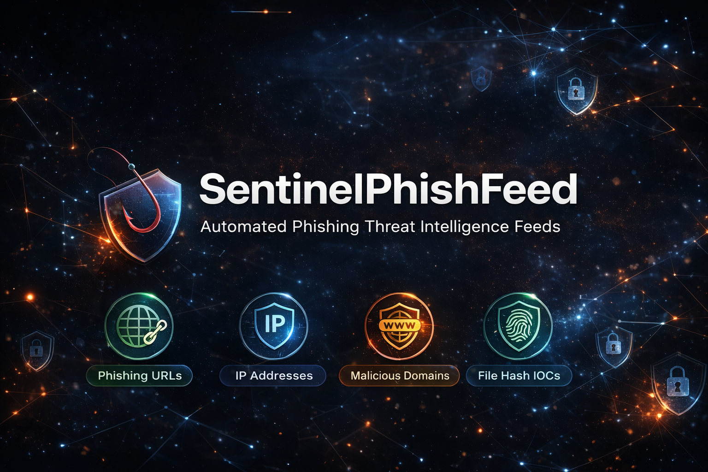

# SentinelPhishFeed

SentinelPhishFeed is an **automated phishing threat intelligence feed**
that provides continuously updated **phishing URLs, malicious IPs,
domains, and IOC data** for defensive cybersecurity use.

It is designed for **SOC teams, blue teams, security researchers,
and detection engineers** who need a reliable, high-signal
**phishing feed** without per-source attribution.

---

## What SentinelPhishFeed provides

- **Phishing URLs feed** → `urls.txt`
- **Malicious IP address feed** → `ips.txt`
- **Phishing & malware domains** → `domains.txt`
- **File hash IOCs** → `hashes.txt`
- **Metadata & timestamps** → `metadata.json`

All indicators are deduplicated, normalized, and ingestion-ready.

---

## Intended use cases

- Phishing detection and prevention
- SOC alert enrichment
- SIEM / SOAR ingestion
- Threat hunting
- Security research

---

<!-- STATS:START -->
## Latest Statistics

- IPs: 188,977
- URLs: 27,150
- Domains: 715,805
- Hashes: 8,681

Last updated: 2025-12-25T03:59:12Z
<!-- STATS:END -->

---

## Update frequency

SentinelPhishFeed updates automatically multiple times per day.
Each update fully replaces the previous dataset.

---

## Disclaimer

This repository is provided **for defensive security purposes only**.
Indicators are provided *as-is*, without warranty or guarantees.
False positives may exist.
